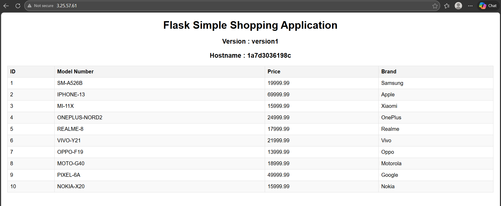
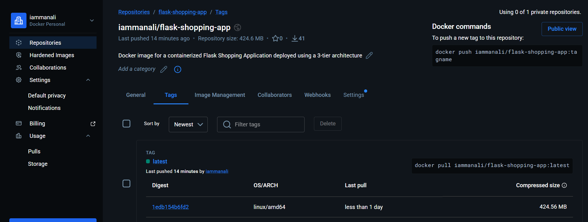
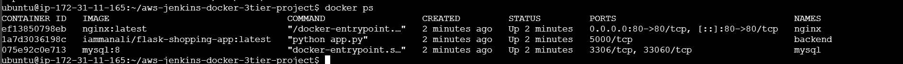

- Nginx acts as reverse proxy
- Flask handles business logic
- MySQL stores application data

---

# 🛠 Tech Stack

- AWS EC2 (Ubuntu 22.04)
- Jenkins (CI/CD)
- Docker & Docker Compose
- DockerHub
- Nginx
- Flask (Python)
- MySQL
- Git & GitHub

---

# ⚙️ CI/CD Pipeline Workflow

1. Developer pushes code to GitHub
2. Jenkins pipeline triggers
3. Docker image is built with build number tag
4. Image pushed to DockerHub
5. Image also tagged as `latest`
6. Jenkins SSH into Application Server
7. Application Server pulls latest image
8. Docker Compose restarts containers

---

# 🔄 Jenkins Pipeline Stages

- Checkout SCM
- Build Docker Image
- Login to DockerHub
- Push Versioned Image
- Update Latest Tag
- Deploy to Application Server

---

# 📸 Project Screenshots

## ✅ Application Running on AWS EC2



---

## ✅ DockerHub Image with Latest Tag



---

## ✅ Docker Containers Running on EC2



---

## ✅ Jenkins Pipeline Successful Build


---

# 🐳 Docker Strategy

Backend image tagging strategy:

- iammanali/flask-shopping-app:<build_number>
- iammanali/flask-shopping-app:latest

Application server always pulls `latest` for deployment.

---

# 🚀 How to Run Locally

```bash
git clone https://github.com/iam-manaligawade/aws-jenkins-docker-3tier-project.git
cd aws-jenkins-docker-3tier-project
docker compose up -d

